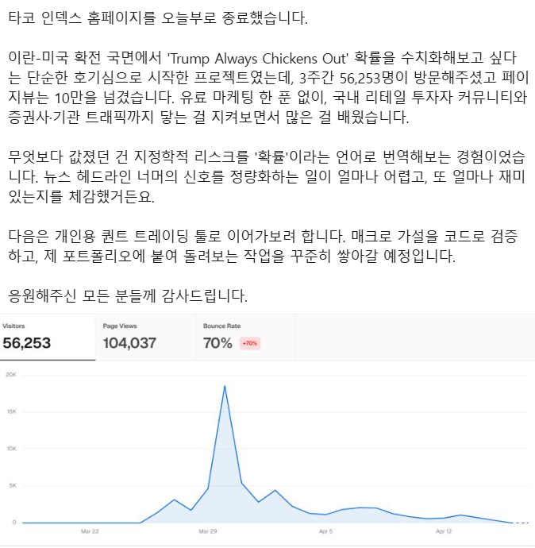

# 타코 트럼프 (타코알리미 · TACO Index)

트럼프 행정부의 강경 정책이 시장 압박 때문에 물러설 가능성을, 시장 지표 여섯 개로 0~6점 한 숫자와 4단계 레벨로 보여 주던 웹 서비스입니다. 2026년 3월 25일에 만들어 `tacotrump.space`에 올렸고, 지금은 서비스를 닫았습니다. 이 저장소는 당시 코드와 배포 설정을 그대로 보관합니다.

> 상태: 종료. 2026년 4월 중순에 3주간의 운영을 마치고 홈페이지를 닫았습니다. 5월에는 같은 서비스를 AWS 서버리스로 옮겨 보는 실험을 했고, 그 뒤 도메인도 정리했습니다. 아래 화면과 수치는 운영 당시 기준입니다.

## 왜 만들었나

뉴스에서 "TACO(Trump Always Chickens Out)"라는 말을 보고, 직접 운영하던 학회 SNS에 올릴 만한 서비스로 만들면 재미있겠다고 생각했습니다. 트럼프가 물러설지 말지는 다들 뉴스 논평으로만 이야기하는데, 그를 압박하는 시장 쪽 숫자를 모아 한 점수로 보여 주면 "지금 몇 단계인지"를 바로 말할 수 있겠다 싶었습니다. 자료를 찾아본 뒤 AI 코딩 도구로 첫 판을 두 시간 만에 만들어 Vercel에 올렸고, 이것이 첫 Vercel 배포였습니다.

## 화면

운영 당시 화면 캡처는 저장소에 남아 있지 않고, 공유용 OG 이미지(`frontend/public/og.png`)와 레벨별 이미지만 있습니다.

화면은 위에서 아래로 이렇게 구성했습니다.

- 현재 레벨 카드: 총점, 레벨(안전·주의·경고·위험), 한 줄 설명, 레벨별 트럼프 이미지
- 핵심 지표 6개 카드: 현재 값, 전일 대비 변화, 레드라인, 개별 점수
- 확장 지표 3개(휘발유, 30년물 국채, 러셀2000): 참고용으로만 표시하고 총점에는 넣지 않음
- 공유 버튼과 알림 설정 배너, 다크 모드, 한국어·영어 전환
- 최근 7일 총점 히스토리 차트
- 하단: 면책 문구, 방문자 수, 소개·개인정보처리방침·이용약관·개발자 API 페이지 링크

## 기간과 역할

| 구간 | 기간 | 내용 |
|---|---|---|
| 첫 판 제작·배포 | 2026-03-25 | 초기 커밋 후 3분 만에 Vercel 배포용 타입 오류 수정 커밋. 이날 저녁 화면 개선 |
| 집중 개선 | 03-26 ~ 03-30 | 43개 커밋. OG 이미지, 방문자 카운터, 공유 버튼, 푸시 알림, SEO, 보안 강화, 다국어 |
| 운영 보강 | 04-07 | 소개·개인정보처리방침·이용약관 페이지(애드센스 승인 대응), 공개 API와 API 키 발급 |
| 운영 종료 | 04 중순 | 3주 운영 뒤 홈페이지 종료 공지 |
| 서버리스 실험 | 05-16 | 서버리스를 직접 다뤄 보고 싶어서 같은 함수들을 AWS Lambda + API Gateway + CloudFront로 옮기는 SAM 템플릿 추가 |
| 정리 | 이후 | 도메인 정리 |

기획부터 개발, 배포, 운영까지 혼자 했습니다. 만든 뒤 직접 운영하던 소속 학회 SNS에 공유했고, 기사가 제작 주체를 학회 회원들로 소개한 것은 그 때문입니다.

### AI와 나눈 일

코드 대부분은 AI 코딩 도구(Claude Code)와 함께 작성했습니다. 어디까지가 제 판단이었는지를 커밋 기록을 기준으로 나누면 아래와 같습니다.

| 직접 결정한 것 | AI에 맡긴 것 | 직접 검토·운영한 것 |
|---|---|---|
| 무엇을 재는 지수로 만들지(트럼프의 말 대신 시장 압박 지표), 지표 여섯 개 구성과 레드라인 값 | 프론트 컴포넌트와 서버리스 함수 코드 작성, 다국어 문구, SEO 메타태그, 서비스워커 | Vercel 배포와 도메인·환경변수 설정, 크론 주기 조정, 애드센스·서치콘솔 등록, SNS 공유와 반응 확인 |
| 알림을 매번이 아니라 레벨이 바뀔 때만 보내기로 한 것 | FastAPI 로컬판과 Vercel 서버리스판 두 벌 작성 | 보안 강화 항목(CORS 화이트리스트, 보안 헤더, 에러 메시지 일반화)을 한 번에 적용 |
| 설명 문구의 맥락 변경(관세 → 이란 → TACO 일반 개념), 홈 위젯 기능을 넣었다가 되돌린 판단 | AWS SAM 템플릿과 Lambda 이식 | 05-16 samconfig에 들어간 Redis 자격 증명을 발견해 제거 |

## 핵심 기능

- 시장 지표 6개를 실시간으로 받아 0~6점 총점과 4단계 레벨로 변환
- 레벨이 바뀐 순간에만 브라우저 푸시 알림 발송 (Web Push, VAPID)
- 최근 7일 총점 히스토리 차트
- 공유 버튼(OG 이미지 포함), 다크 모드, 한국어·영어 전환
- 개발자용 공개 API(`/api/v1/*`)와 이메일 기반 API 키 발급(하루 1,000회 제한, 이메일당 3개)
- 방문자 카운터, 소개·약관 페이지

## 구조와 기술적 판단

### 점수 계산

지표마다 "안전값(safe)"과 "레드라인(redline)"을 두고, 현재 값이 그 사이 어디에 있는지를 0~1로 선형 보간합니다. 여섯 개를 가중치 없이 더해 총점(만점 6.0)을 만들고, 1.8 / 3.0 / 4.2를 경계로 레벨 1~4를 매깁니다.

| 지표 | 출처 | safe | redline |
|---|---|---|---|
| E-mini S&P 선물 52주 고점 대비 하락률 | Yahoo Finance `ES=F` | -3% | -15% |
| VIX | Yahoo Finance `^VIX` | 15 | 35 |
| 미 10년물 국채금리 | Yahoo Finance `^TNX` | 4.0% | 4.5% |
| WTI 유가 | Yahoo Finance `CL=F` | 75달러 | 100달러 |
| 달러 인덱스 | Yahoo Finance `DX-Y.NYB` | 97 | 110 |
| 대통령 지지율 | RealClearPolling 페이지 스크래핑 | 50% | 35% |

레드라인 값은 제가 정한 값이고 통계적 근거를 두고 고른 것은 아닙니다. 이 점수는 "시장 압박 지표가 위험 구간에 얼마나 가 있는가"를 뜻하고, 트럼프가 물러설 확률을 예측한 값이 아닙니다.

### 상시 서버 없이 굴리기

배포판은 Vercel의 정적 프론트와 파이썬 서버리스 함수 7개로만 이루어집니다. 함수는 요청이 올 때마다 Yahoo와 RealClearPolling을 직접 호출하고, `Cache-Control: s-maxage`(총점 30초, 히스토리 300초)로 엣지에 캐시해 외부 호출량을 눌렀습니다. 서버리스에는 호출 사이에 남는 메모리가 없어서, 푸시 구독 목록과 "직전 레벨"은 호스팅형 Redis에 두었습니다. 매시간 도는 Vercel Cron이 현재 레벨을 계산해 직전 레벨과 비교하고, 달라졌을 때만 구독자 전원에게 푸시를 보냅니다. 만료된 구독(HTTP 410)은 그 자리에서 지웁니다.

크론 경로는 배포된 사이트의 공개 URL이기 때문에 함수 안에서 `CRON_SECRET`을 직접 검증합니다. Hobby 플랜의 크론 제한 때문에 주기를 하루 1회로 내렸다가 사흘 뒤 매시간으로 되돌린 기록이 있습니다.

### 두 벌의 백엔드

`backend/`에는 FastAPI + APScheduler + SQLite + WebSocket으로 된 로컬 전체 기능판이, `api/`에는 Vercel 서버리스판이 따로 있습니다. 먼저 익숙한 FastAPI로 전체를 만들고, 배포 단계에서 Vercel 제약(상시 프로세스와 WebSocket 없음)에 맞춰 축약판을 따로 쓴 순서로 보입니다. 점수 로직을 공유 모듈로 빼지 않고 복제했기 때문에 두 판이 어긋나는 문제가 생겼고, 이 내용은 아래 한계에 적었습니다.

### 무료 데이터와 fallback

Yahoo Finance v8 chart 엔드포인트, FRED, RealClearPolling 스크래핑 모두 무과금 소스입니다. 모든 fetch에 fallback 상수를 두어 외부가 죽어도 화면이 빈 채로 멈추지 않게 했습니다. 대신 실패가 화면에 보이지 않는다는 문제가 남았고, 이것도 한계에 적었습니다.

### 기술 스택

프론트는 React 19, Vite, TypeScript, Tailwind CSS 4, recharts입니다. 배포 API는 파이썬 표준 라이브러리의 `BaseHTTPRequestHandler`로 직접 구현한 Vercel 서버리스 함수이고, 로컬판은 FastAPI입니다. 상태 저장은 호스팅형 Redis, 알림은 pywebpush, Truth Social 글 요약에는 OpenAI API를 썼습니다.

운영을 마친 뒤 5월에는 서버리스를 직접 다뤄 보고 싶어서 같은 함수들을 AWS Lambda(API Gateway, CloudFront, S3)로 옮기는 SAM 템플릿을 만들었습니다. Vercel이 감춰 주던 것(함수별 라우팅, CORS, 크론 스케줄, 정적 파일 배포)을 템플릿에 직접 적어 보는 것이 목적이었고, 이 구성은 실험으로 끝났습니다.

## 실제 결과

의도한 마케팅은 없었고, 만든 날 학회 SNS에 공유한 것이 여러 커뮤니티의 인기 게시물로 퍼졌습니다. 2026년 4월 3일 KPI뉴스가 "'트럼프 본심' 숫자로 읽는다…고대생이 만든 '타코알리미'"라는 제목으로 이 서비스를 소개했습니다. 기사는 지표 구성과 레벨 기준을 설명하고, 도이체방크의 압박지수와 BCA리서치의 트럼프 고통지수 같은 해외 사례를 나란히 소개했으며, 전쟁 국면에서는 이런 지표를 과신하면 안 된다는 증권사 연구위원의 의견도 함께 실었습니다. 기사가 쓰인 4월 3일의 총점은 3.13점(3단계 경고)이었고, 3월 27일에 3.99점까지 올랐던 것이 운영 기간 중 가장 높은 값이었습니다.

운영 3주 동안의 방문 수치는 Vercel Analytics 기준으로 이렇습니다.



| 항목 | 값 |
|---|---|
| 방문자 | 56,253명 |
| 페이지뷰 | 104,037 |
| 이탈률 | 70% |
| 하루 최고 방문 | 3월 29일 전후, 약 1만 8천 명 |

유료 마케팅은 한 푼도 쓰지 않았고, 국내 리테일 투자자 커뮤니티에서 시작된 트래픽이 증권사와 기관 쪽 접속까지 닿는 것을 지켜봤습니다. 기사 보도와 방문 수치는 서비스가 관심을 받았다는 근거이지, 지수의 예측 정확도나 성능이 검증됐다는 뜻은 아닙니다. 점수가 실제 정책 번복보다 앞섰는지 확인한 기록은 없습니다.

운영하면서 한 일은 이렇습니다. 방문자 카운터와 Vercel Analytics를 붙였고, 검색 노출을 위해 sitemap과 JSON-LD, hreflang을 넣었으며, 애드센스 승인 절차에 맞춰 소개·약관 페이지를 만들었습니다. 외부 개발자가 점수를 가져다 쓸 수 있도록 공개 API와 키 발급 화면도 추가했습니다.

## 한계와 회고

### 코드에서 확인되는 한계

- 점수 로직이 `backend/`와 `api/`에 복제되어 이미 어긋나 있습니다. 로컬판은 지지율을 빼고 다섯 개만 합산하면서 레벨 경계는 만점 6.0 기준을 그대로 써서 점수가 낮게 나옵니다. 레벨 1 색상값도 두 판이 다릅니다.
- 프론트 상수 파일의 레드라인 값(S&P -20%, 10년물 5.0%, 유가 120달러, 달러 115)이 API의 값(-15%, 4.5%, 100달러, 110)과 다릅니다. 표시용으로만 쓰이는지는 확인이 더 필요합니다.
- 주석과 설정이 코드와 어긋난 곳이 있습니다. 점수 함수 주석의 임계값(-5/-20)이 실제 상수(-3/-15)와 다르고, 크론 함수 설명은 "5분마다"인데 실제 설정은 매시간입니다.
- 히스토리 차트의 과거 총점은 지지율 항이 오늘 값으로 고정된 값입니다. 지지율 과거 데이터가 없어 현재값을 전 구간에 적용했기 때문입니다. 실시간은 E-mini 선물, 히스토리는 S&P 현물 지수를 써서 같은 축에 다른 소스가 그려집니다.
- 지지율 스크래핑은 페이지 문자열 뒤 500자를 정규식으로 긁는 방식이라, 페이지 구조가 바뀌면 조용히 기본값 41.3으로 떨어지고 화면은 정상처럼 보입니다. 다른 fallback도 성질이 같습니다.
- 테스트가 없습니다. 위 어긋남은 두 구현이 같은 입력에 같은 점수를 내는지 확인하는 테스트 하나만 있었어도 잡혔을 것들입니다.
- 푸시 발송이 구독자를 하나씩 도는 직렬 루프라, 구독자가 많아지면 서버리스 실행 시간 제한에 먼저 닿습니다. 실제로 재 본 기록은 없습니다.

### 회고

이란과 미국의 확전 국면에서 "트럼프는 항상 물러선다"는 말을 숫자로 바꿔 보고 싶다는 호기심으로 시작한 프로젝트였는데, 가장 값졌던 것은 지정학적 리스크를 점수라는 언어로 번역해 보는 경험이었습니다. 뉴스 헤드라인 너머의 신호를 정량화하는 일이 얼마나 어렵고 또 얼마나 재미있는지를 체감했고, 그 점수가 확률이라고 불릴 자격이 있는지는 위 한계에 적은 대로 아직 검증하지 못했습니다.

동시에 이 프로젝트를 하면서 코딩이 AI 시대로 넘어갔다는 것을 처음 체감했습니다. 두 시간 만에 배포까지 갈 수 있었던 것은 AI 도구 덕이었고, 그다음 엿새 동안 43번 커밋하며 붙인 알림, 공유, 다국어, 보안 강화도 대부분 AI와 같이 썼습니다. 그래서 "왜 개발하는가"를 다시 생각하게 됐습니다. 코드를 빨리 뽑아내는 일 자체는 값이 내려갔고, 어떤 이슈를 잡아 어떤 형태로 만들어 누구에게 보여 줄지 정하는 일과, 나온 결과를 검토하고 운영하는 일이 남았다고 생각합니다.

동시에 빨리 만든 대가도 봤습니다. 두 벌의 백엔드가 어긋난 채로 배포됐고, 레드라인 값의 근거를 남기지 않았으며, 실패를 fallback으로 덮어 보이지 않게 만들었습니다. 이 경험은 이후 [My_WIKI](https://github.com/accidentable/My_WIKI)에서 프로젝트를 되짚어 정리하는 계기가 됐습니다.

## 실행법

로컬 전체 기능판(FastAPI + Vite)을 함께 띄우려면 다음과 같이 합니다.

```bash
npm run install:all
npm run dev
```

`backend/.env`에 `FRED_API_KEY`가 필요합니다(`backend/.env.example` 참고). 프론트는 `http://localhost:5173`, 백엔드는 `http://localhost:8000`에서 뜹니다.

Vercel 서버리스판(`api/`)은 다음 환경변수를 씁니다.

| 변수 | 용도 |
|---|---|
| `REDIS_URL` | 푸시 구독, 직전 레벨, API 키 저장 |
| `KV_REST_API_URL`, `KV_REST_API_TOKEN` | 방문자 카운터 (Upstash REST) |
| `VAPID_PRIVATE_KEY`, `VAPID_SUBJECT`, `VITE_VAPID_PUBLIC_KEY` | Web Push. 키는 `scripts/generate-vapid.py`로 생성 |
| `CRON_SECRET` | 크론 엔드포인트 인증 |
| `OPENAI_API_KEY` | Truth Social 글 요약(없으면 원문 반환) |

AWS로 올리려면 `aws/template.yaml`과 `aws/deploy.sh`를 참고합니다. 이 설정은 2026년 5월 이전 시점의 것이고, 지금은 서비스를 닫았으므로 실제 배포는 검증하지 않았습니다.

## 관련 링크

- KPI뉴스 기사 (2026-04-03): https://m.kpinews.kr/newsView/1065595079655327
- 이 프로젝트를 정리한 위키 문서: https://github.com/accidentable/My_WIKI/blob/main/wiki/projects/taco-index-2026-03.md
